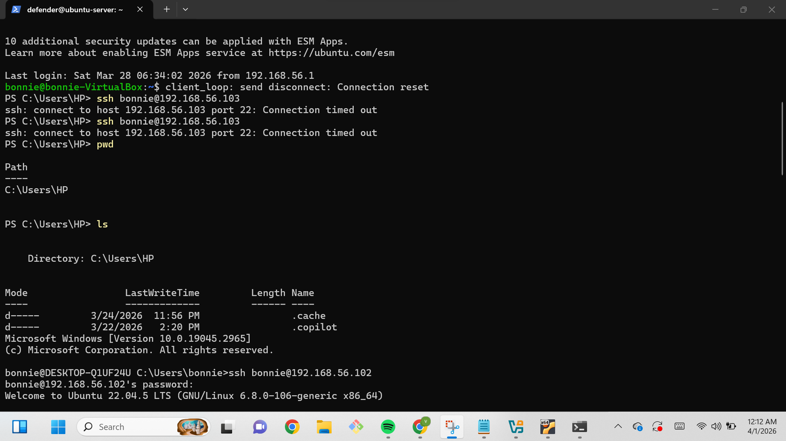
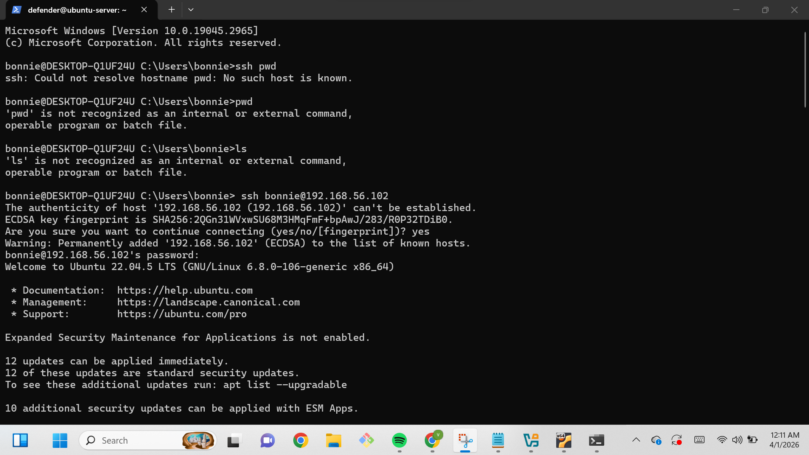
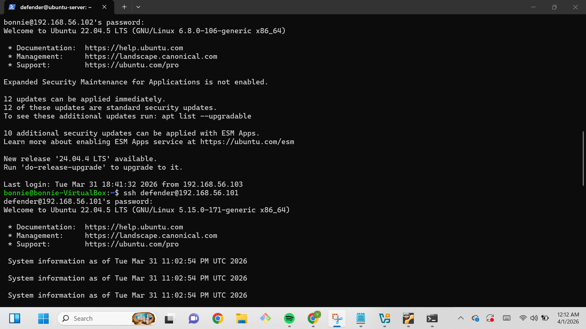
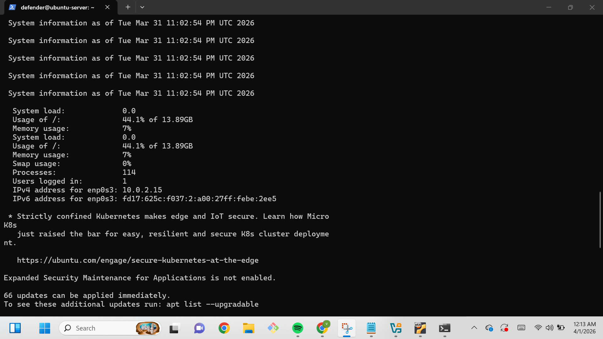
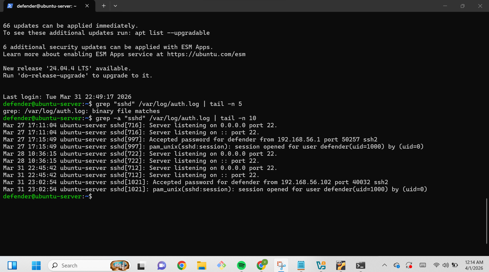

# Multi-Hop Lateral Movement & Telemetry Correlation

### Victor Ushie | Aspiring SOC Analyst

## 🛡️ Executive Summary

This project simulates a **4-stage attack chain** to analyze how lateral movement appears in system logs. By pivoting through multiple operating systems, I demonstrated how an attacker can mask their original source IP and what a SOC Analyst must look for to trace activity back to "Patient Zero."

---

## 🏗️ Lab Architecture

- **Stage 1 (Origin):** Windows 11 Host
- **Stage 2 (Pivot A):** Windows 10 VM (Workstation) - `192.168.56.103`
- **Stage 3 (Pivot B):** Ubuntu Desktop VM - `192.168.56.102`
- **Stage 4 (Target):** Ubuntu Server VM - `192.168.56.101`

---

## 🛠️ Phase 1: Troubleshooting Infrastructure (Initial Access)

The simulation began with an attempt to SSH from the Host into the first Windows VM.

**The Obstacle:** I encountered a `Connection timed out` error. Through troubleshooting, I identified that the OpenSSH Server service was not installed on the Windows target.

_Initial failure showing the connection timeout and manual directory checks on the host._

**The Resolution:** I used PowerShell to deploy the OpenSSH capability. I initially faced syntax errors while starting the service, but successfully resolved them by separating the commands to ensure the `sshd` service was running and set to automatic.

---

## 🕵️‍♂️ Phase 2: Execution of the Lateral Movement

Once the Windows jump-box was secured, I executed the pivot into the Linux environment.

**The Transition:**
From the Windows VM (`bonnie`), I established an SSH connection to the Ubuntu Desktop (`192.168.56.102`).

_Successful SSH handshake moving from a Windows environment into Linux._

**The Final Hop:**
From the Ubuntu Desktop, I moved to the final target: the **Ubuntu Server**. This created a "double-blind" scenario where the server would not have direct visibility of the original Windows Host.

_Reaching the 'Crown Jewel' (Ubuntu Server) via the intermediate jump-box._

---

## 🔍 Phase 3: Forensic Log Correlation

As a SOC Analyst, I audited the target server's telemetry to see if the attack path was visible.

**Observation 1: System Identification**
I verified the target system's internal IP (`10.0.2.15`) and resource usage to ensure I was monitoring the correct "Crown Jewel" asset.

_Target system identification and resource audit._

**Observation 2: The "Identity Blind Spot"**
A standard `grep` search for SSH logs initially returned a `binary file matches` error. By using `grep -a`, I successfully extracted the raw authentication logs.

**The Evidence:** The logs recorded the login source as `192.168.56.102` (The Ubuntu Desktop). Without a centralized SIEM, the original Windows Host (`.103`) is completely hidden from the Server's local logs.

_Forensic evidence showing the source IP of the immediate jump-box, effectively masking the true origin._

---

## 🚀 Key Takeaways

1. **Network Obfuscation:** Lateral movement successfully hides the attacker's true origin from local host logs.
2. **Defensive Necessity:** This lab highlights why **Centralized Logging (SIEM)** is mandatory for security teams to correlate logs across the entire environment.
3. **Infrastructure Knowledge:** SOC Analysts must be comfortable with both Windows PowerShell and Linux command lines to troubleshoot and defend modern networks.
