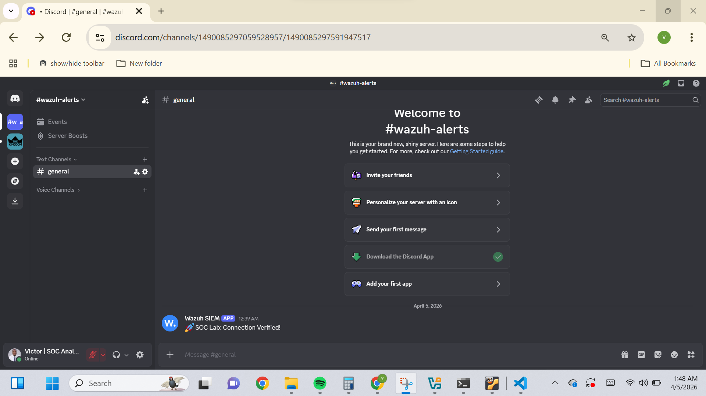

# 🛡️ SOC Automation Lab: Wazuh SIEM & Discord Integration

## 📜 Project Overview

This project demonstrates the setup and configuration of a **Security Operations Center (SOC)** environment using the **Wazuh SIEM/XDR** platform. The core focus was to bridge the gap between security telemetry and real-time incident response by integrating **Discord Webhooks** for automated alerting.

By simulating real-world attacks, I validated the end-to-end pipeline—from initial event generation on a Windows endpoint to automated notification in a dedicated SOC channel.

---

## 🛠️ Technical Architecture

- **SIEM/XDR:** Wazuh Manager (Ubuntu Server 22.04)
- **Endpoints:** Windows 10 Pro (Wazuh Agent)
- **Integration:** Discord API (Outgoing Webhooks)
- **Simulation Tools:** THC-Hydra (Brute Force), PowerShell (Defense Evasion)
- **Virtualization:** Oracle VirtualBox (Host-Only Networking)

---

## 🚀 Key Implementation Steps

### 1. Endpoint Configuration & Telemetry

- Installed and configured the **Wazuh Agent** on a Windows 10 workstation.
- Established a secure connection to the Wazuh Manager, enabling the streaming of **Sysmon** and **Windows Event Logs**.

### 2. Custom Integration Engineering

- Configured the `ossec.conf` on the Wazuh Manager to handle external API calls.
- Integrated the **Discord Webhook** using the `/slack` compatibility layer to ensure structured JSON payloads were delivered successfully.
- Set alert thresholds to **Level 3+**, ensuring critical security events are prioritized for notification.

### 3. Adversarial Simulation (Testing the SOC)

To validate the detection capabilities, I performed the following simulations:

- **Brute Force Attack:** Used **Hydra** from the Ubuntu terminal to simulate high-velocity login attempts against the Windows target.
- **Defense Evasion:** Executed `wevtutil cl Security` to simulate an attacker clearing logs to hide their tracks.
- **Persistence:** Created unauthorized administrative users via PowerShell to trigger "User Creation" alerts.

---

## 📊 Detection & Triage Results

| Security Event    | MITRE ATT&CK ID | Wazuh Rule ID | Alert Severity |
| :---------------- | :-------------- | :------------ | :------------- |
| **Log Clearing**  | T1070.001       | 18113         | **High (10)**  |
| **Brute Force**   | T1110           | 5712          | **Medium (5)** |
| **User Creation** | T1136.001       | 4720          | **Medium (5)** |

### ✅ Evidence of Success

> _Above: Successful API handshake between the Wazuh Manager and Discord._

---

## 🧠 Challenges & Performance Optimization

Operating this lab on a **8GB RAM** environment presented significant resource constraints.

- **The Solution:** I optimized the environment by leveraging **Wazuh Logtest** for rule validation and using native Ubuntu tools for internal attack simulations, reducing the overhead of running multiple high-resource Virtual Machines simultaneously.
- **Takeaway:** This taught me the importance of **Resource Management** and **Service Monitoring** in a production SIEM environment.

---

## 🏁 Conclusion & Future Work

This lab successfully bridged the gap between raw security telemetry and actionable alerting. By integrating **Wazuh** with **Discord**, I transformed a passive monitoring system into an active notification pipeline, reducing the "Time to Detection" for critical events like Log Tampering and Brute Force attacks.

### 🎓 Key Takeaways:

- **API Resilience:** Learned to troubleshoot and validate webhook handshakes using `curl` and manual log injection.
- **SIEM Logic:** Mastered the difference between a "Log" and an "Alert" by fine-tuning rule thresholds.
- **Resource Management:** Successfully maintained a full SOC stack on limited (8GB) hardware by optimizing service uptime.

### 🔮 Next Steps:

- Implement **Active Response** (shun/block IPs) directly from the Wazuh Manager.
- Integrate **Suricata** for Network Intrusion Detection (NIDS) to monitor traffic patterns alongside host logs.
